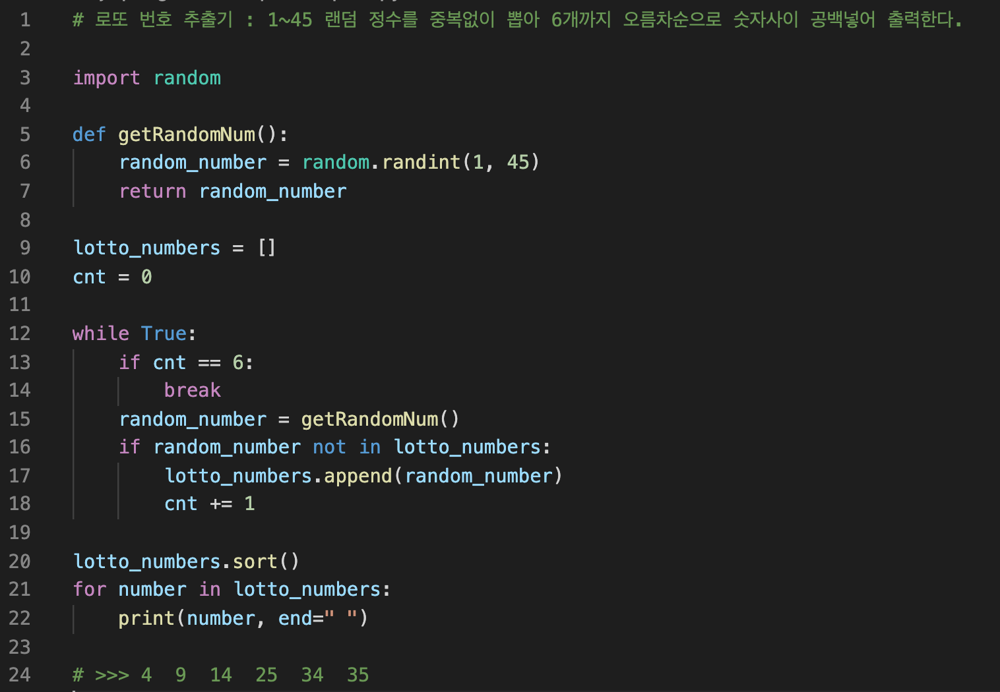
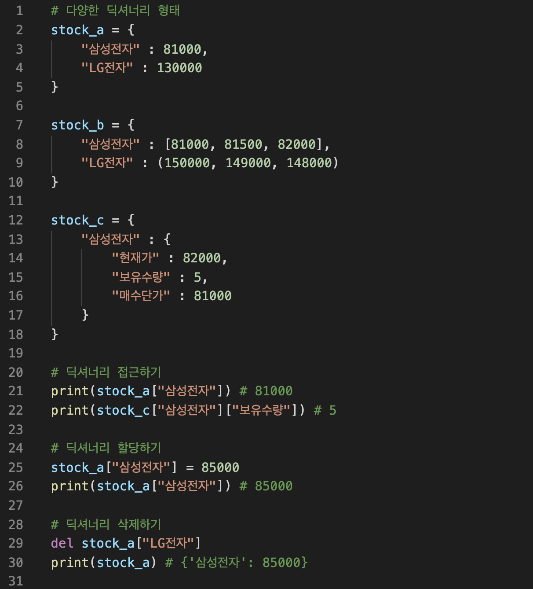
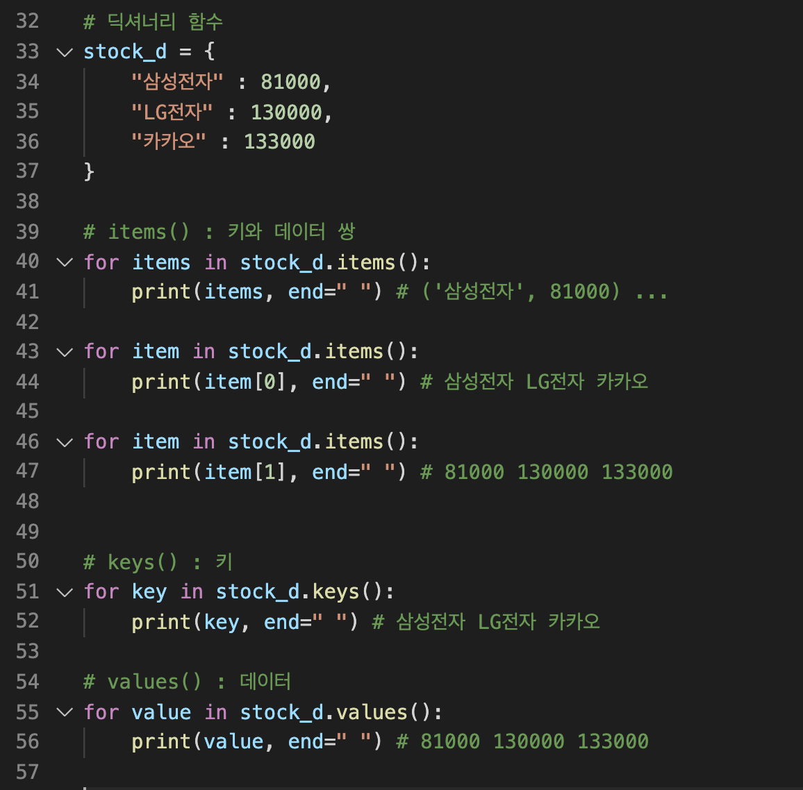

# 추석특강~oh~~


## 프린트문

- print 요소 띄어쓰기 없이 붙여서 출력하기

```python
print(1, 3, 2, sep=" ")
>>> 132
```

- print 이어서 출력하기

```python
print(1, 3, 2, end=" ")
print(0, 1)
>>> 1 3 2 0 1
```


## 연산

- 복합 할당 연산자

```python
# 레벨 1 증가
level = 10
level += 1

# 체력 300 감소
health = 2000
health -= 300

# 공격력 1.5배 증가
attack = 300
attack *= 1.5

# 이속 50% 감소
speed = 420
speed /= 2
```

- 논리연산

```python
A and B # A, B 모두 참일때 True
A or B  # A, B 중 하나라도 참이면 True
not A   # A 가 참이면 False

print("a" != "a" or "b" == "b") # False or True
>>> True
```

- 멤버십 연산

```python
in : 포함되어 있다
not in : 포함되어 있지 않다
# True or False

print("a" in "abc")
>>> True
```


## 입력

- Input() 함수

  1. 할당연산자(=) 를 만나면 오른쪽부터 실행한다.

  2. 함수 실행시 메세지를 출력하고 입력을 기다린다.

  3. 데이터 입력 후 엔터를 치면 imput 함수에 데이터가 들어가고

  4. x에 저장된다.

```python 
x = input("입력하세요>>>")
```


## 출력

- 문자열과 변수 함께 출력하기

```python
year = int(input("태어난 연도를 입력하세요>>>"))
age = 2021 - year + 1

print("현재나이는", age, "살 입니다.")
>>> 현재 나이는 29살 입니다.
```


## 조건이 있는 제어문

```python
# 세 과목의 평균 점수가 80점 이상이면 "합격", 미만이면 "불합격"을 출력한다.
# 단 0점에서 100점 사이의 숫자를 입력하지 않으면 "잘못입력"를 출력한다.

total = a + b + c
avg = total / 3
```

**방법 1. 조건을 먼저 걸고 이후 제어문(중첩조건문)을 실행**

```python
if 0 <= a <= 100 and 0 <= b <= 100 and 0 <= c <= 100:
  if avg >= 80:
    print("합격")
  else:
    print("불합격")
else:
  print("잘못입력")
```

**방법 2. 중첩조건문 쓰지 않고 조건 입력**

```python
# or 논리이므로 하나라도 참이면 참이다.
if a < 0 or a > 100 or b < 0 or b > 100 or c < 0 or c > 100:
  print("잘못입력")
elif avg >= 80:
  print("합격")
else:
  print("불합격")
```


## 리스트

- 데이터 조작

```python
arr = [1, 2, 3]
# 데이터 추가, 할당, 삭제

arr.append(4)
>>> arr = [1, 2, 3, 4]

arr[0] = 0
>>> arr = [0, 2, 3, 4]

del arr[1]
>>> arr = [0, 3, 4]

------------------------------------
arr = [3, 4, 2, 1]
# 슬라이싱
arr[1:3] # [4,2]

# 길이
len(arr) # 4

# 정렬
arr.sort() # [1, 2, 3, 4]
arr.sort(reverse=True) # [4, 3, 2, 1]
```


## for 반복문

반복할 횟수가 정해졌을 때 사용

> for 변수 in 시퀀스자료:
>
> ​	명령문


## while 반복문

반복할 횟수가 정해지지 않았을 때 사용

> 초기식
>
> while 조건식:
>
> ​	반복할 명령
>
> ​	증감식

```python
i = 0 # 초기식
while i < 10: # 조건식
  print(i, "번째 입니다")
  i += 1 # 증감식
  
# 범위는 초기식과 조건식, 증감식으로 수정한다.
i = 5
while i < 10:
  print(i, "번째 입니다")
  i += 2 
```


### 무한루프와 break

- 조건식에 True를 넣어 항상 반복되게 만든 것
- break 를 통해 가장 가까운 반복문 1개만 탈출

> while True:
>
> ​	반복할 명령
>
> ​	if 조건식:
>
> ​		break

```python
while True:
  x = input("종료하려면 exit를 입력하세요>>>")
  if x == "exit":
    break
```


- 연습문제


## 함수

매개변수와 반환값은 옵션이다.

> <정의하기>
>
> def 함수이름(매개변수1, 매개변수2):
>
> ​	명령블록
>
> ​	return 반환값
>
> <호출하기>
>
> print(함수이름(인자1, 인자2))

1. 기본형 : 매개변수도, 반환값도 없는 경우

```python
def printHello():
    print("Hello")

printHello()
>>>Hello
```

2. 매개변수가 있는 함수

```python
def sum(a, b):
    print(a+b)

sum(1, 2)
>>>3
```

3. 반환값이 있는 함수

```python
import random
def getRandomNumber():
    number = random.randint(1,10)
    return number

print(getRandomNumber())
>>>5
```

4. 매개변수와 반환값이 있는 함수

```python
def add(a, b):
    result = a + b
    return result
  
print(add(5,6))
>>>11
```

- f-string

```python
def printSumAvg(x, y, z):
    total = x + y + z
    avg = total / 3
    
    return print(f"합계: {total} 평균: {avg}")
```

- 함수는 하나의 기능만 가진다! for문은 따로 써주자




## 튜플

수정, 추가, 삭제가 불가능하고 읽기만 가능해 데이터 손실 염려가 없다.

메모리가 고정되어있어 메모리 사용이 효율적이다.

괄호 생략이 가능하다.

> 튜플 = (데이터, 데이터, 데이터)
>
> 튜플 = 데이터, 데이터, 데이터       # 괄호 생략


- 한개의 데이터인 튜플은 콤마를 붙여줘야 한다.

```python
a = (30,)
a = 30,
```

- 리스트를 튜플로 만든다.

```python
a = tuple([5,6,7])
```

```python
x = list(range(10))
a = tuple(x)
```

- 튜플을 리스트로 만든다.

```python
x = 5, 6, 7
a = list(x)
```

- 패킹과 언패킹

```python
numbers = 3, 4, 5 #패킹
a, b, c = numbers #언패킹
```

- 튜플 함수

```python
a = 10, 20, 30, 30
# 특정 값의 인덱스 구하기
a.index(20) >>> 1 
# 특정 값의 개수
a.count(30) >>> 2
```


## 딕셔너리

> 딕셔너리 = {키1:데이터1, 키2:데이터2}


- 접근하기

```python
딕셔너리["키"]
```

- 할당하기

```python
딕셔너리["키"] = 데이터
```

- 삭제하기

```python
del 딕셔너리 ["키"]
```



- 딕셔너리 함수

```python
딕셔너리.items()
딕셔너리.keys()
딕셔너리.values()
```




