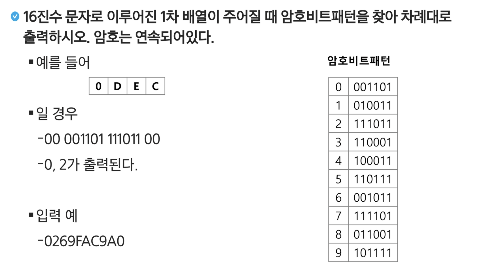
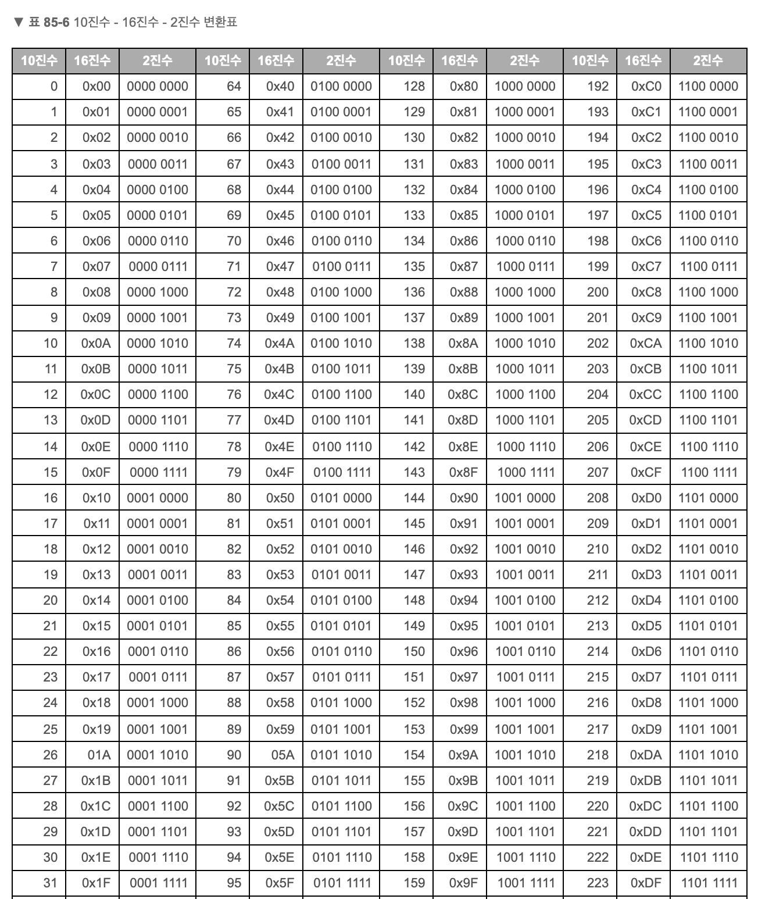
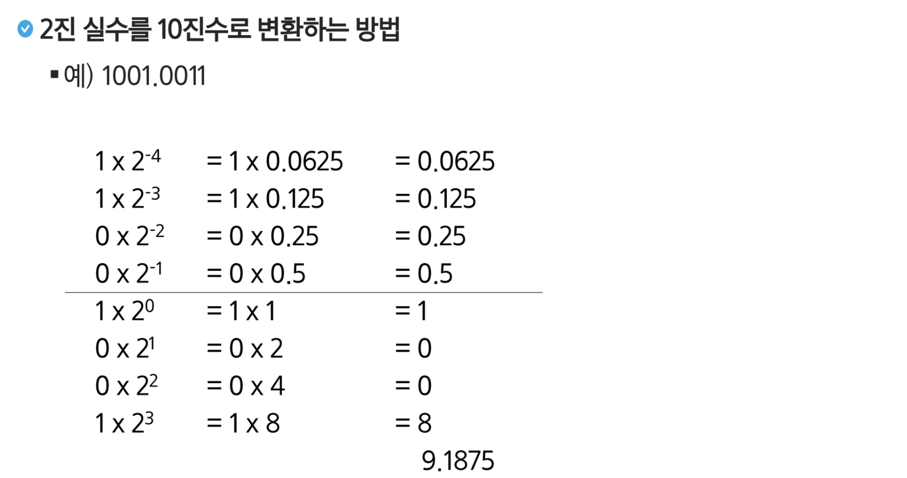
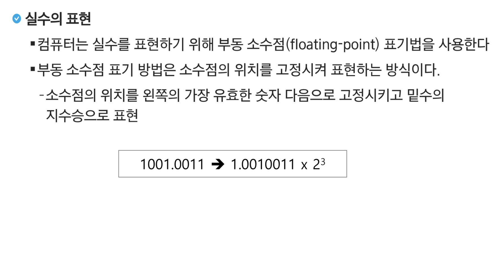
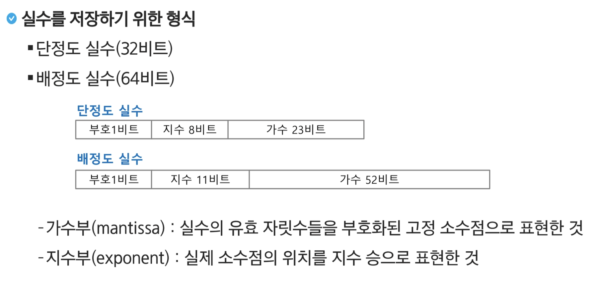

## 문제



- 0 / 13 / 14 / 12
- 0000 0000 / 0000 1101 /  0000 1110 / 0000 1100
- 0000 / 1101 / 1110 / 1100 
- 00 / 001101 / 111011 / 00
- 0 / 2

```python
# 10진수를 16진수로 변환
hexadecimal = hex(42)

# 10진수를 8진수로 변환
octal_number = oct(42)

# 10진수를 2진수로 변환
binary_number = bin(42)

# 16진수를 10진수로 변환
octal_number = int('0x2A', 16)

# 8진수를 10진수로 변환
octal_number = int('0o52', 8)

# 2진수를 10진수로 변환
octal_number = int('0b101010', 2)
```

`format()` 내장 함수를 이용하면 숫자를 다른 진수의 문자열로 바꿀 때 접두어를 제외할 수 있습니다.

```python
>>> format(42, 'b')
'101010'
>>> format(42, 'o')
'52'
>>> format(42, 'x')
'2a'
>>> format(42, 'X')
'2A'
>>> format(42, 'd')
'42'
```



## 10진수를 16진수로 변환하기

10진수를 16진수로 변환하는 방법은 10진수를 2진수로 변환하는 방법과 큰 틀이 같습니다. 16으로 나누었을 때 나머지를 구해서 10보다 작으면 0~9까지의 값이고 10보다 크면 A~F까지의 값입니다.


10진수를 16으로 나누었을 때 나머지를 구해서 10보다 작으면 배열에 0~9까지의 문자를 넣어주고, 10보다 크거나 같으면 배열에 A~F까지의 문자를 넣어주면 됩니다. 즉, 0~9는 숫자 0의 ASCII 코드 값 48을 더해주고, A~F는 영문 대문자 A의 ASCII 코드 값 65를 더해주면 됩니다(소문자로 출력하고 싶다면 97을 더함). 단, 10보다 크거나 같을 때는 10을 빼서 0, 1, 2, 3, 4, 5를 A, B, C, D, E, F에 일치시킵니다.

아래 자리부터 변환했으므로 출력할 때는 역순으로 출력합니다.

```c
#define _CRT_SECURE_NO_WARNINGS
#include <stdio.h>
#include <string.h>

int main()
{
    int decimal = 300;                // 10진수 300
    char hexadecimal[20] = { 0, };    // 16진수로 된 문자열을 저장할 배열
    
    int position = 0;
    while (1)
    {
        int mod = decimal % 16;    // 16으로 나누었을 때 나머지를 구함
        if (mod < 10) // 나머지가 10보다 작으면
        {
            // 숫자 0의 ASCII 코드 값 48 + 나머지
            hexadecimal[position] = 48 + mod;
        }
        else    // 나머지가 10보다 크거나 같으면
        {
            // 나머지에서 10을 뺀 값과 영문 대문자 A의 ASCII 코드 값 65를 더함
            hexadecimal[position] = 65 + (mod - 10);
        }

        decimal = decimal / 16;    // 16으로 나눈 몫을 저장

        position++;    // 자릿수 변경

        if (decimal == 0)    // 몫이 0이되면 반복을 끝냄
            break;
    }

    // 배열의 요소를 역순으로 출력
    for (int i = position - 1; i >= 0; i--)
    {
        printf("%c", hexadecimal[i]);
    }

    printf("\n");

    return 0;
}
```


## 다른 진수의 형태로 숫자를 표현하기

파이썬에서는 기본적으로 10진수 형태로 숫자를 표현하기 때문에 다른 진수의 형태로 숫자를 표현하려면 다음과 같이 숫자 앞에 접두어를 붙여줘야 합니다.

- 2진수: `0b`
- 8진수: `0o`
- 16진수: `0x`

```python
>>> 42 == 0b101010
True
>>> 42 == 0o52
True
>>> 42 == 0x2a
True
```

해당 진수에서 허용하는 범위에서 벗어난 숫자를 사용하면 `SyntaxError`가 발생하니 주의해야 합니다.

```python
>>> 0b2
  File "<stdin>", line 1
    0b2
     ^
SyntaxError: invalid token
```


## 숫자에서 다른 진수의 문자열로 변환하기

파이썬은 `bin()`, `oct()`, `hex()`라는 내장 함수를 제공합니다. 이 함수를 통해서 숫자를 각 진수의 형태의 문자열로 변환할 수 있습니다.

```python
>>> bin(42)
'0b101010'
>>> oct(42)
'0o52'
>>> hex(42)
'0x2a'
```

함수의 인자로 숫자를 넘길 때, 10진수를 사용하든 2진수를 사용하든 결국 동일한 숫자 값을 다른 진수의 형태로 표현한 것뿐이기 때문에 결과는 동일해야 합니다.

```python
>>> bin(0b101010)
'0b101010'
>>> oct(0b101010)
'0o52'
>>> hex(0b101010)
'0x2a'
>>> str(0b101010)
'42'
```


## 다른 진수의 문자열로 숫자형으로 변환하기

`bin()`, `oct()`, `hex()`로 변환한 문자열들을 어떻게 다시 숫자로 변환할 수 있을까요? 평소에 문자열을 숫자로 바꾸기 위해서 자주 사용하시던 `int()` 함수에 진수의 base 값을 추가 인자로 넘겨주시면 됩니다.

```python
>>> int('0b101010', 2)
42
>>> int('0o52', 8)
42
>>> int('0x2a', 16)
42
```

사실 `int()` 함수의 2번째 인자는 디폴트값이 10이기 때문에 생략했을 경우 10진수의 문자열이 숫자로 변환되는 것입니다.

```python
>>> int('42', 10)
42
>>> int('42')
42
```








