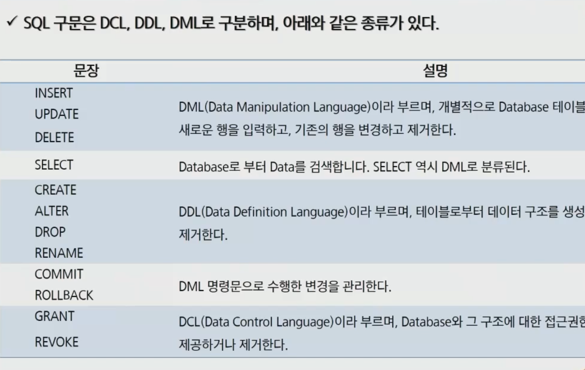
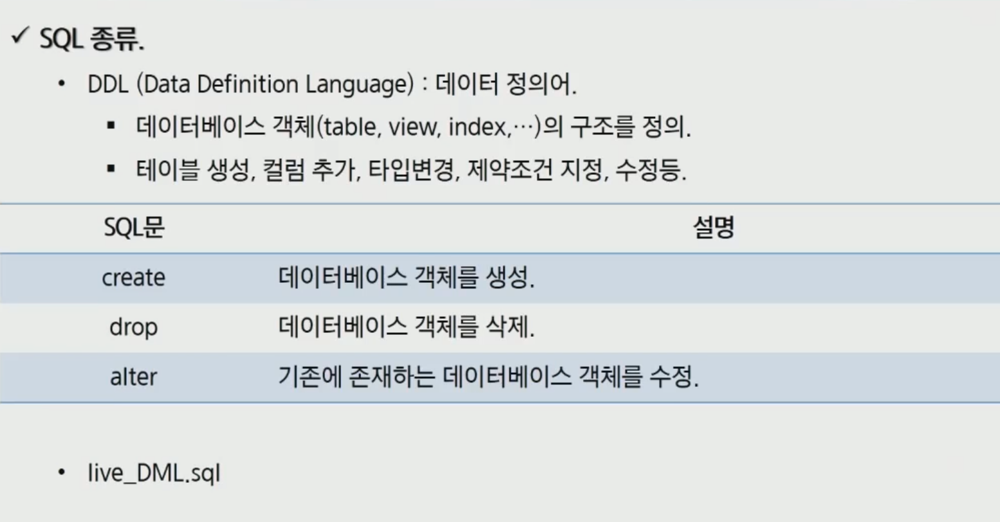
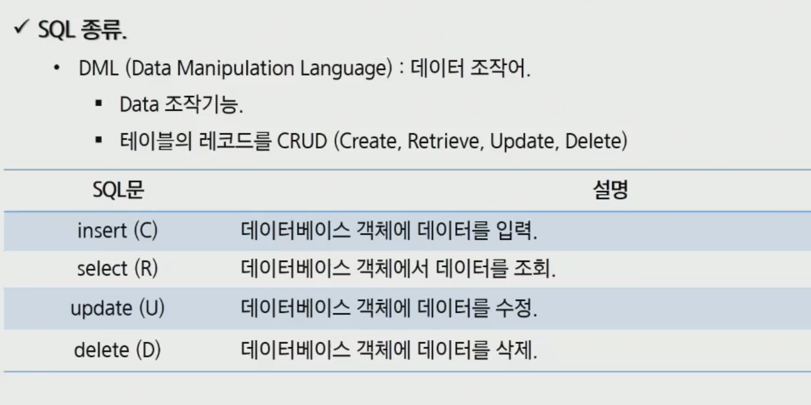
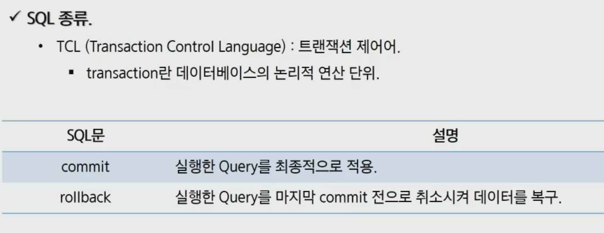

[TOC]

# RDBMS & SQL

### RDBMS

- 데이터를 테이블 단위로 관리

- 중복데이터를 최소화 하는 정규화
- 여러 테이블에 분산되어 있는 데이터를 검색 시 테이블 간의 관계(join) 를 이용하여 필요한 데이터를 검색

### SQL(Structured Query Language)

- 모든 DBMS에서 사용 가능
- 대소문자 구별하지 않음 (데이터는 구분)




# DDL

Data Definition Language



```mysql
CREATE DATABASE dbtest
DEFAULT CHARACTER SET utf8mb4 COLLATE utf8mb4_general_ci;
```


# DML (Insert, Update, Delete)

Data Manipulation Language

개별적으로 데이터베이스 테이블에서 새로운 행을 입력하고, 기존의 행을 변경하고 제거한다.




```mysql
INSERT INTO ssafy_member (userid, username, userpwd, emailid, emaildomain, joindate)
VALUES ('kimssafy', '김싸피', '1234', 'kimssafy', 'ssafy.com', now())
```

```mysql
INSERT INTO ssafy_member (username, userid, userpwd, joindate)
VALUES ('김싸피', 'kimssafy','1234', now())
```


# DML (Select)

# DCL


# TCL

- `commit` 가상메모리에 있는 데이터를 조작하고, 바꾼 것을 실제 원본데이터에 적용하는것.
- `rollback` 복구



# 내장함수

# Transaction

# Constraint 제약조건

- 데이터의 무결성을 지키기 위해, 데이터를 입력받을 때 실행되는 검사 규칙이다.

MySQL에서 사용할 수 있는 제약 조건은 다음과 같다.

 

**1. NOT NULL**

**2. UNIQUE**

**3. PRIMARY KEY**

PRIMARY KEY 제약 조건을 설정하면, 해당 필드는 **NOT NULL과 UNIQUE 제약 조건의 특징을 모두 가진다.**

따라서 이 제약조건이 설정된 필드는 NULL 값을 가질 수 없으며, 또한 중복된 값을 가질 수 없다.

이러한 PRIMARY KEY 제약 조건을 기본 키라고 한다.

테이블의 데이터를 쉽고 빠르게 찾도록 도와주는 역할을 한다.

```mysql
1. CREATE TABLE 테이블이름 ( 필드이름 필드타입 PRIMARY KEY, ... ) 
2. CREATE TABLE 테이블이름 ( 필드이름 필드타입, ..., [CONSTRAINT 제약조건이름] PRIMARY KEY (필드이름) )
```


**4. FOREIGN KEY**

FOREIGN KEY 제약 조건을 설정한 필드를 외래 키라고 부르며, **한 테이블을 다른 테이블과 연결해주는 역할을 한다.**

외래 키가 설정된 테이블에 레코드를 입력하면, 기준이 되는 테이블의 내용을 참조해서 레코드가 입력된다.

즉, FOREIGN KEY 제약 조건은 하나의 테이블을 다른 테이블에 의존하게 만든다.

FOREIGN KEY를 설정할 때 **참조되는 테이블의 필드는 반드시 UNIQUE나 PRIMARY KEY가 설정되어 있어야 한다.**

```mysql
CREATE TABLE 테이블이름 ( 
  필드이름 필드타입, ..., 
  [CONSTRAINT 제약조건이름] 
  FOREIGN KEY (필드이름) 
  REFERENCES 테이블이름 (필드이름) 
)
```

**간단한 예**

Test2 테이블의 ParentID 필드에 Test1 테이블의 ID 필드를 참조하는 FOREIGN KEY 제약 조건을 설정하는 예이다.

```mysql
CREATE TABLE Test2 ( 
  ID INT,
  ParentID INT, 
  FOREIGN KEY (ParentID) 
  REFERENCES Test1(ID) ON UPDATE CASCADE 
);
```

**1. ON DELETE**

\- 참조되는 테이블의 **값이 삭제될 경우의 동작**을 **ON DELETE 구문으로 설정**

**2. ON UPDATE**

\- 참조되는 테이블의 **값이 수정될 경우의 동작**을 **ON UPDATE 구문으로 설정**

설정할 수 있는 동작은 아래와 같다.

1. **CASCADE** : 참조되는 테이블에서 데이터를 삭제하거나 수정하면 참조하는 테이블에서도 **삭제와 수정이 같이 이루어짐**

2. **SET NULL** : 참조되는 테이블에서 데이터를 삭제하거나 수정하면 참조하는 테이블의 **데이터는 NULL로 변경**됨

3. **NO ACTION** : 참조되는 테이블에서 데이터를 삭제하거나 수정하면 참조하는 테이블의 **데이터는 변경되지 않음**

4. **SET DEFAULT** : 참조되는 테이블에서 데이터를 삭제하거나 수정하면 참조하는 테이블의 **데이터는 필드의 기본값으로 설정**

5. **RESTRICT** : 참조하는 테이블에 데이터가 남아 있으면 참조되는 테이블의 **데이터를** **삭제하거나 수정할 수 없음**


**5. DEFAULT**

DEFAULT 제약 조건은 해당 필드의 **기본값을 설정**할 수 있게 해준다.

만약 레코드를 입력할 때 해당 필드 값을 전달하지 않으면, 자동으로 설정된 기본 값을 저장한다.


# mySQL에서의 INDEX

- 데이터를 더욱 빠르게 탐색할 수 있는 필드라고 한다.


# ddl.sql, dump.sql

ddl.sql 파일은 

dump.sql 파일은 데이터베이스를 모아 담아 