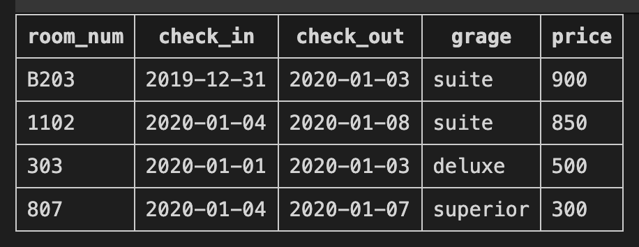
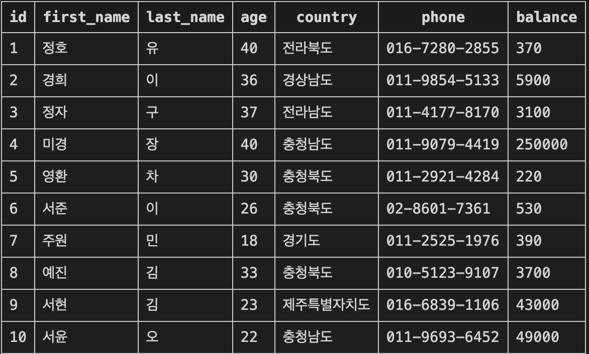

# SQL & ORM in Django

### 실행(장고 프로젝트)

- ORM

  ```bash
  # 가상환경 셋팅(셸 설치)
  python -m venv venv
  source venv/bin/activate
  # 셸플러스 실행
  python manage.py shell_plus
  ```

- SQL

  ```bash
  sqlite3 db.sqlite3
  ```


### 비교예시

| SQlite                                                       | ORM                                                          |
| ------------------------------------------------------------ | ------------------------------------------------------------ |
| SELECT * FROM users_user;                                    | User.objects.all().query (쿼리는 옵션)                       |
| INSERT INTO users_user VALUES (102, '길동', '김', 20, '서 울', '010-1234-1234', 100); | User.objects.create(first_name='길동', last_name='홍', age=10, country='제주', phone='010-1234-1234', balance=100,) |
| SELECT * FROM users_user WHERE id=102;                       | User.objects.get(pk=102)                                     |
| UPDATE users_user SET first_name='철수'  WHERE id=102;       | user = User.objects.get(pk=102)<br/>user.last_name<br/>user.last_name = '홍'<br/>user.save()<br/> |
| DELETE FROM users_user WHERE id=101;                         | user = User.objects.get(pk=100)<br/>user.delete()            |
| SELECT COUNT(*) FROM users_user;                             | len(User.objects.all()<br/>User.objects.count()              |
| SELECT COUNT(*) FROM users_user WHERE age>=30;               | User.objects.filter(age__gte=30).count()                     |
| SELECT COUNT(*) FROM users_user WHERE age<=20;               | User.objects.filter(age__lte=20).count()                     |


### 1. SQL Query 



```sql
-- 1. 테이블 생성
CREATE TABLE countries(
room_num TEXT,
check_in TEXT,
check_out TEXT,
grage TEXT,
price INT
);

-- 2. 데이터 입력
INSERT INTO countries (room_num, check_in, check_out, grage, price) VALUES ('1102', '2020-01-04', '2020-01-08', 'suite', 850);
INSERT INTO countries (room_num, check_in, check_out, grage, price) VALUES ('B203', '2019-12-31', '2020-01-03', 'suite', 900);
INSERT INTO countries (room_num, check_in, check_out, grage, price) VALUES ('303', '2020-01-01', '2020-01-03', 'deluxe', 500);
INSERT INTO countries (room_num, check_in, check_out, grage, price) VALUES ('807', '2020-01-04', '2020-01-07', 'superior', 300);

-- 3. 테이블 이름 변경
ALTER TABLE countries RENAME TO hotels;

-- 4. 객실 가격을 내림차순으로 정렬하여 상위 2개의 room_num과 price 조회
SELECT room_num, price FROM hotels ORDER BY price DESC LIMIT 2;

✅-- 5. grade별 분류하고 분류된 grade 개수를 내림차순으로 조회
✅-- GROUP BY 사용 
SELECT grade, COUNT(grade) FROM hotels GROUP BY grade ORDER BY COUNT(grade) DESC;

-- 6. 객실 위치가 지하 혹은 등급이 deluxe인 객실의 모든 정보 조회
SELECT * FROM hotels WHERE room_num LIKE 'B%' OR grade='suite';

✅-- 7. 지상층 객실이면서 2020년 1월 4일에 체크인한 객실의 목록을 price 오름차순으로 조회
✅-- NOT LIKE 사용
SELECT * FROM hotels WHERE room_num NOT LIKE 'B%' AND check_in='2020-01-04'ORDER BY price;

-- 추가) 열 이름 변경
ALTER TABLE hotels RENAME COLUMN grage TO grade;
```


---


## 2. SQL ORM 비교 




1. user 테이블 전체 데이터를 조회하시오.

	
    ```python
    # orm
    User.objects.all()
    ```

    ```sql
    -- sql
    SELECT * FROM users_user;
    ```


2. id가 19인 사람의 age를 조회하시오.

	
    ```python
    # orm
    User.objects.filter(id=19).values('age')
    ```

    ```sql
    -- sql
    SELECT age FROM users_user WHERE id = 19;
    ```


3. 모든 사람의 age를 조회하시오.

	
    ```python
    # orm
    User.objects.values('age')
    ```

    ```sql
    -- sql
    SELECT age FROM users_user;
    ```


4. age가 40 이하인 사람들의 id와 balance를 조회하시오.

	
    ```python
    # orm
    User.objects.filter(age__lte=40).values('id','b
        ...: alance')
    ```
    
    ```sql
    -- sql
    SELECT id, balance FROM users_User WHERE age <= 40;
    ```


5. last_name이 '김'이고 balance가 500 이상인 사람들의 first_name을 조회하시오.

	
    ```python
    # orm
    User.objects.filter(last_name='김', balance__lt
        ...: e=500).values('first_name')
    ```
    
    ```sql
    -- sql
    SELECT first_name FROM users_user WHERE
       ...> last_name = '김' AND balance >= 500;
    ```


6. first_name이 '수'로 끝나면서 행정구역이 경기도인 사람들의 balance를 조회하시오.

	
    ```python
    # orm
    User.objects.filter(first_name__endswit
        ...: h='수', country='경기도').values('balan
        ...: ce')
    ```
    
    ```sql
    -- sql
    WHERE first_name LIKE '%수' AND country = '경기도';
    ```


7. balance가 2000 이상이거나 age가 40 이하인 사람의 총 인원수를 구하시오.

	
    ```python
    # orm
    User.objects.filter(Q(balance__gte=2000
        ...: )|Q(age__lte=40)).count()
    ```
    
    ```sql
    -- sql
    SELECT COUNT(*) FROM users_user WHERE balance >= 2000 OR age <= 40;
    ```


8. phone 앞자리가 '010'으로 시작하는 사람의 총원을 구하시오.

	
    ```python
    # orm
    User.objects.filter(phone__startswith='010').count()
    ```

    ```sql
    -- sql
    SELECT COUNT(*) FROM users_user WHERE phone LIKE '010%';
    ```


9. **❇️ 이름이 '김옥자'인 사람의 행정구역을 경기도로 수정하시오.**


   1. **방법 1번 - 하나의 인스턴스를 수정한다**.

   ```python
   # orm
   user = User.objects.filter(first_name='옥자', last_name='김')[0]
   user.country = '경기도'
   user.save()
   ```

   2. **방법 2번 - filter로 가져온 쿼리셋을 수정한다. - Update 메소드 사용**

   ```python
   #orm
   user.objects.filter(first_name='옥자', last_name='김').update(country='경기도')
   ```

   3. **방법 3번 - get을 써도 단일데이터면 괜찮다. 그러나 중복가능성 있음.**

   ```python
   # orm
   user = User.objects.get(first_name='옥자', last_name='김')
   user.country = '경기도'
   user.save()
   ```

   ```sql
   -- sql
   UPDATE users_user SET country = '경기도' WHERE first_name = '옥자' AND last_name = '김';
   ```

10. 이름이 '백진호'인 사람을 삭제하시오.

     ```python
     # orm
     user = User.objects.get(first_name='진호', last_name='백')
     user.delete()
     ```

     ```sql
     -- sql
     DELETE FROM users_user WHERE first_name='진호' AND last_name='백'; 
     ```

11. balance를 기준으로 상위 4명의 first_name, last_name, balance를 조회하시오.

       ```python
    # orm
    User.objects.order_by('-balance')[:4].values('first_name','last_name', 'balance')
       ```
       ```sql
       -- sql
       SELECT first_name, last_name, balance FROM users_user ORDER BY balance DESC LIMIT 4;
       ```
    
12. phone에 '123'을 포함하고 age가 30 미만인 정보를 조회하시오.

    ```python
    # orm
    User.objects.filter(phonecontains='123', agelte=30)
    ```
      ```sql
      -- sql
      SELECT * FROM users_user WHERE phone LIKE '%123%' AND age < 30;
      ```
    
13. **❇️ phone이 '010'으로 시작하는 사람들의 행정구역을 중복없이 조회하시오.**

      - `field lookup` 사용
      - 중복없이 조회 : `distinct` 메소드 사용

      ```python
      # orm
      User.objects.filter(phone__startswith='010').values('country
      ').distinct()
      ```

      ```sql
      -- sql
      SELECT DISTINCT country FROM users_user WHERE phone LIKE '010%';
      ```

14. 모든 인원의 평균 age를 구하시오.

    ```python
    # orm
    User.objects.aggregate(Avg('age'))
    ```
      ```sql
      -- sql
      SELECT AVG(age) FROM users_user;
      ```
    
15. 박씨의 평균 balance를 구하시오.

    ```python
    # orm
    User.objects.filter(last_name='박').aggregate(Avg('balance'))
    ```
      ```sql
      -- sql
      SELECT AVG(balance) FROM users_user WHERE last_name = '박';
      ```
    
16. 경상북도에 사는 사람 중 가장 많은 balance의 액수를 구하시오.

    ```python
    # orm
    User.objects.filter(country='경상북도').aggregate(Max('balance'))
    ```
      ```sql
      -- sql
      SELECT MAX(balance) FROM users_user WHERE country='경상북도';
      ```
    
17. 제주특별자치도에 사는 사람 중 balance가 가장 많은 사람의 first_name을 구하시오.

    ```python
    # orm 3가지
    
    User.objects.filter(country='제주특별자치도').order_by('-balance')[:1].values('first_name')
    User.objects.filter(country='제주특별자치도').order_by('-balance')[0].values('first_name')
    User.objects.filter(country='제주특별자치도').order_by('-balance').first().values('first_name')
    ```
      ```sql
      -- sql
      SELECT first_name FROM users_user WHERE country='제주특별자치도' ORDER BY balance DESC LIMIT 1;
      ```
