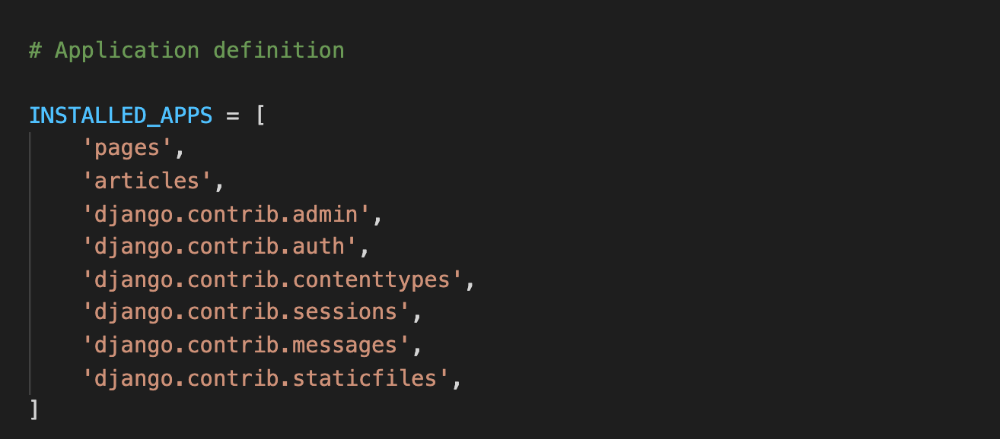

# django 실행순서

#### 1. 루트폴더 생성 및 폴더 내 이동

```python
mkdir <folder name>
cd <folder name>
```

#### 2. 가상환경 생성 및 활성화

- 가상환경 생성 - 일반적으로 <name>에는 venv를 사용

```python
python -m venv <name>
```

- 가상환경 활성화

```bash
# Window OS
source <name>(보통 venv)/Scripts/activate
```

```bash
# mac os
source <name>/bin/activate
```

- 파일 적용

```python
pip install -r requirements.txt
```

- 변경된 사항을 반영

```python
pip freeze > requirements.txt
```

- 가상환경 종료

```python
deactivate
```

#### 3. 장고 설치

```python
pip install django
```


---


#### 4 .gitignore , README.md 파일제작

- .gitignore 로 만든 후, 웹사이트 들어가 내용 복사 붙여넣기


```python
touch README.md .gitignore
```


#### 5. git 등록

#### 6. 장고 프로젝트 생성

- '.' 을 찍어야, 프로젝트 폴더와 manage.py 가 동일경로에 위치!!!!!

```python
django-admin startproject <name> .
```

#### 7. 장고 앱 생성 및 등록

- **이때 앱 이름은 반드시 (모델에 작성한 클래스의) 복수형으로 사용! (articles 등)**

```python
python manage.py startapp <name>
```

- **생성 후에는 무조건 등록! (project folder 내의 settings.py)**
  - local apps - 생성한 앱
  - 3rd party apps  - 'django_extensions'
  - django apps




#### 8. 파이썬 버젼 잡기

- 인터프리터에 설정된 파이썬 위치에서 찾고있기 때문에, 우리는 venv 안에서 장고를 설치했으므로 찾지 못한다.
- 그래서 파이썬을 다시 잡아준다. vscode가 보고 있는 파이썬이 전역파이썬이 아닌  venv 안의 파이썬이 된다.


### 추가설정 settings.py

- 한국어 설정

```python
LANGUAGE_CODE = 'ko-kr'
```

- 한국시간 설정

```python
TIME_ZONE = 'Asia/Seoul'
```
