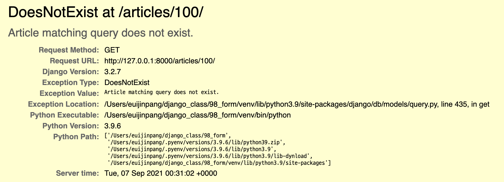
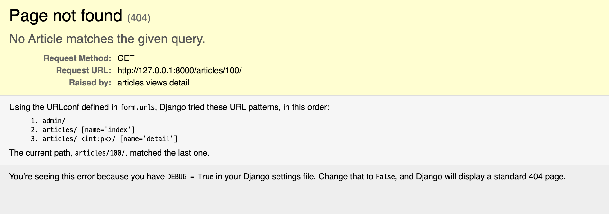

# HTTP 요청처리

- Django에서 HTTP 요청을 처리하는 방법
  1. Django shortcut functions
  2. View decorators

### 1. Django shortcut functions

- get_object_or_404()
- get_list_or_404()

# 404 page로 만들기

# HTTP verb

- put, patch 둘 다 업데이트 Put은 모든 데이터를 다 수정, patch는 부분 수정
- 장고는 get, post 방식만을 사용한다. html5 form 태그가  post, get 방식만 지원하기 때문이다.
- post 가 생성 수정 삭제까지 다 하는 셈이다.

# HTTP 요청 메서드

https://developer.mozilla.org/ko/docs/Web/HTTP/Methods

HTTP는 **요청 메서드**를 정의하여, 주어진 리소스에 수행하길 원하는 행동을 나타냅니다. 간혹 요청 메서드를 "HTTP 동사"라고 부르기도 합니다. 각각의 메서드는 서로 다른 의미를 구현하지만, 일부 기능은 메서드 집합 간에 서로 공유하기도 합니다. 이를테면 응답 메서드는 [안전](https://developer.mozilla.org/ko/docs/Glossary/Safe)하거나, [캐시 가능 (en-US)](https://developer.mozilla.org/en-US/docs/Glossary/cacheable)하거나, [멱등성](https://developer.mozilla.org/ko/docs/Glossary/Idempotent)을 가질 수 있습니다.

- [`GET`](https://developer.mozilla.org/ko/docs/Web/HTTP/Methods/GET)

  `GET` 메서드는 특정 리소스의 표시를 요청합니다. `GET`을 사용하는 요청은 오직 데이터를 받기만 합니다.

- [`HEAD`](https://developer.mozilla.org/ko/docs/Web/HTTP/Methods/HEAD)

  `HEAD` 메서드는 `GET` 메서드의 요청과 동일한 응답을 요구하지만, 응답 본문을 포함하지 않습니다.

- [`POST`](https://developer.mozilla.org/ko/docs/Web/HTTP/Methods/POST)

  `POST` 메서드는 특정 리소스에 엔티티를 제출할 때 쓰입니다. 이는 종종 서버의 상태의 변화나 부작용을 일으킵니다.

- [`PUT`](https://developer.mozilla.org/ko/docs/Web/HTTP/Methods/PUT)

  `PUT` 메서드는 목적 리소스 모든 현재 표시를 요청 payload로 바꿉니다.

- [`DELETE`](https://developer.mozilla.org/ko/docs/Web/HTTP/Methods/DELETE)

  `DELETE` 메서드는 특정 리소스를 삭제합니다.

- [`CONNECT`](https://developer.mozilla.org/ko/docs/Web/HTTP/Methods/CONNECT)

  `CONNECT` 메서드는 목적 리소스로 식별되는 서버로의 터널을 맺습니다.

- [`OPTIONS`](https://developer.mozilla.org/ko/docs/Web/HTTP/Methods/OPTIONS)

  `OPTIONS` 메서드는 목적 리소스의 통신을 설정하는 데 쓰입니다.

- [TRACE (en-US)](https://developer.mozilla.org/en-US/docs/Web/HTTP/Methods/TRACE)

  `TRACE` 메서드는 목적 리소스의 경로를 따라 메시지 loop-back 테스트를 합니다.

- [`PATCH`](https://developer.mozilla.org/ko/docs/Web/HTTP/Methods/PATCH)

  `PATCH` 메서드는 리소스의 부분만을 수정하는 데 쓰입니다.
